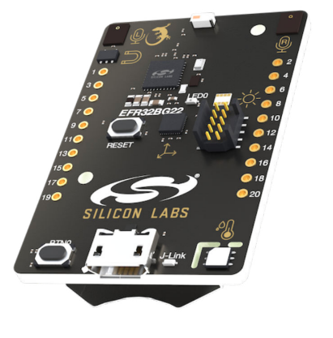
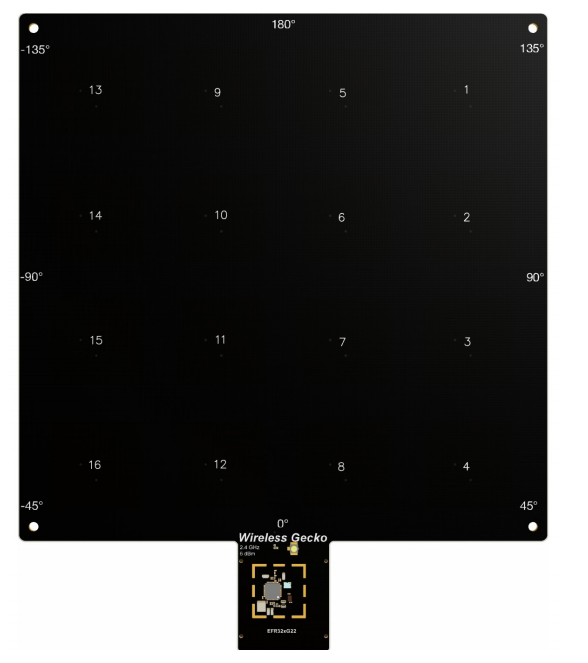

# Aplicação de coleta de IQs e demonstração do cálculo de ângulo

Este diretório contem aplicações que auxiliam na coleta de amostras de IQs com os kits de DoA da Silicon Labs. Contém também exemplos de estimação de DoA em tempo real.

## Materias necessários

### Transmissor
O transmissor é uma placa **Thunderboard-BG22** da Silicon Labs

### Receptor
O receptor é um kit de âncora **BRD-4185** junto com um [**WSTK**](https://www.silabs.com/development-tools/wireless/efr32xg22-wireless-starter-kit#manuals)

## Carregando o software do transmissor

   `
   ./flash_firmware.sh transmitter/bt_aoa_soc_asset_tag.s37
   `

## Carregando o software do receptor

   `
   ./flash_firmware.sh receiver_files/bt_aoa_ncp_locator.s37
   `

## Compilando o software que controla a âncora

`
sudo apt install libmosquitto-dev
`

`
cd receiver
`

`
make
`

## Rodando a aplicacao

Antes de executar, descubra o endereço MAC do receptor e do transmissor.
1. Para saber qual o endereço MAC do receptor, conecte-o ao computador e execute o comando
`receiver/exe/bt_aoa_host_locator -c ../config/locator_config.json -u <porta_serial_alocada_do_receptor (Ex. /dev/ttyACM0)>`. Ele deve aparecer na tela de LOG.
2. Para saber qual o endereço MAC do trnasmissor, conecte-o ao computador e inicie a comunicação serial com um baud rate de 115200 bps. Reinicie o dispositivo e o MAC deve aparecer na tela de LOG.

Com os endereços MAC em mãos, execute:

`
/get_iq_samples.sh <MAC_RECEPTOR (Ex. F80332010203)> <MAC_TRANSMISSOR> <porta_serial_alocada_para_o_receptor (Ex. /dev/ttyACM0)>
`
## Demonstração de estimação de ângulo

O repositório contem tambem um exemplo de como implementar uma estimação simples de ângulo no diretório "main_application_v1"